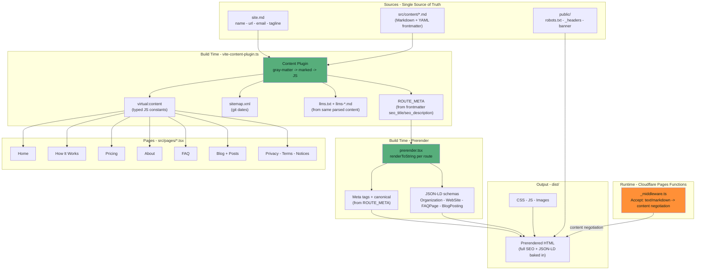

# Sivussa.com

AI-native website visibility audit service. Preact SPA with build-time content pipeline, prerendering, and Cloudflare Pages deployment.

> Staging site: https://staging.323-wolf-pages.pages.dev/
> Staging CMS link: https://app.pagescms.org/negatrait/323-wolf-pages/staging/

>- **If you are an agent reading this document:** The following sections must guide your every action and decision when working in this repo - read and obey them.

***

## Hard Laws

Current implementation sprint is allways outlined in `SPRINT.md` - it is the definitive guide and scratchpad that must be followed strictly!
1. **Plan first:** Outline the plan in `SPRINT.md` - what is the goal of this sprint?
2. **Review code second:** By reviewing and citing the codebase against the sprint plan, identify the gaps that need to be refactored and implemented to accomplish the sprint goals - what can be removed entirely, what needs to be refactored, what new features need to be implemented?
3. **Implement:** Only when you understand the codebase, implement the steps in the plan. Which step is best implemented first?
4. **Review the implementation:** Follow the natural progression of the code - what are your findings?
5. **Simplify and correct based on your findings:** Complex, sprawling code is strictly forbidden in this codebase, only simple textbook best practices are allowed - could you have made it simpler?
6. **Verify the commit:** The CI/CD pipeline must pass - did you try to take shortcuts?

## Architecture



## How It Works

### Content Pipeline

Everything visible on the site is derived from `src/content/*.md` at build time. Nothing is hardcoded in components.

1. **Author content** in `src/content/` as markdown with YAML frontmatter
2. **Build time**: `vite-content-plugin.ts` reads all markdown via `gray-matter`, renders HTML via `marked`, and emits:
   - `virtual:content` - typed JS constants imported by page components
   - `ROUTE_META` - per-route title/description/canonical from `seo_title`/`seo_description` frontmatter
   - `SITE_CONFIG` - site identity (name, url, email, tagline) from `site.md`
   - `llms.txt` + 5 `llms-*.md` files - AI agent content from the same parsed markdown
   - `sitemap.xml` - all routes with git last-modified dates
3. **Prerender**: `prerender.tsx` renders each route to static HTML with full meta tags and JSON-LD schemas
4. **Deploy**: Push to `main` -> Cloudflare Pages auto-builds and deploys

### What's Derived vs. Authored

| Source | Derived At Build Time | Used By |
|--------|----------------------|---------|
| `site.md` frontmatter | `SITE_CONFIG` constant | All pages, JSON-LD, llms files, seo.ts, Nav |
| `seo_title` frontmatter | `<title>`, og:title, JSON-LD | prerender.tsx |
| `seo_description` frontmatter | `<meta description>`, og:description | prerender.tsx |
| Page content markdown | HTML for components | All page components |
| `pricing.md` tiers | `PRICING_TIERS` | Pricing.tsx, llms-pricing.md |
| `faq.md` Q&A | `FAQ_ITEMS` | FAQ.tsx, llms-faq.md, JSON-LD FAQPage |
| Blog post files | `BLOG_POSTS_MAP` | BlogPost.tsx, sitemap, JSON-LD BlogPosting |
| `nav.md` | `NAV_CONFIG` | Nav.tsx |
| `footer.md` | `FOOTER_SECTIONS` | Footer.tsx |

### JSON-LD Structured Data

Generated exclusively in `prerender.tsx` - page components never construct schemas.

| Schema | Where | Source |
|--------|-------|--------|
| Organization + WebSite | Every page (global) | `SITE_CONFIG` from `site.md` |
| SoftwareApplication | Home only | `SITE_CONFIG` |
| FAQPage | `/faq` only | `FAQ_ITEMS` from `faq.md` |
| BlogPosting | Blog posts only | `BLOG_POSTS_MAP` from post frontmatter |

### Agent Accessibility

- **Content negotiation**: `_middleware.ts` serves markdown when `Accept: text/markdown` is sent
- **llms.txt + llms-*.md**: Built by content plugin from same parsed markdown — one source of truth
- **Agent Skills**: `/.well-known/agent-skills/` provides navigation skill for agents
- **Content Signals**: `robots.txt` declares `ai-train=no, search=yes, ai-input=no`
- **Link header**: `_headers` adds `Link: <llms.txt>; rel=describedby`

### SPA Navigation

After first page load, `Head.tsx` handles client-side meta tag mutations and JSON-LD updates on route changes. This is supplementary — all SEO-relevant data is already in the prerendered HTML.

## Project Structure

```
├── functions/
│   └── _middleware.ts            # Markdown content negotiation for AI agents
├── public/                       # Static assets (copied to dist/)
│   ├── _headers                  # Cloudflare response headers
│   ├── robots.txt                # Crawler directives + Content Signals
│   ├── sivussa-banner.webp       # Hero banner image
│   └── .well-known/
│       └── agent-skills/         # Agent Skills index + SKILL.md files
├── src/
│   ├── app.tsx                   # Router — all routes defined here
│   ├── index.tsx                 # Entry point (hydrate)
│   ├── index.css                 # Tailwind theme + global styles
│   ├── prerender.tsx             # Build-time prerender + JSON-LD
│   ├── components/
│   │   ├── common/               # Accordion, Button, Section
│   │   ├── content/              # FeatureCard, PricingCard, StepCard
│   │   ├── layout/               # Layout, Nav, Footer, BreadcrumbNav
│   │   └── seo/                  # Head (client-side meta mutations for SPA)
│   ├── content/                  # ← Single source of truth for all visible content
│   │   ├── site.md               #   Site identity (name, url, email, tagline)
│   │   ├── about.md              #   About page
│   │   ├── faq.md                #   FAQ items
│   │   ├── footer.md             #   Footer sections
│   │   ├── nav.md                #   Navigation config
│   │   ├── home/
│   │   │   ├── hero.md           #   Title, subtitle, CTAs, seo_title, seo_description
│   │   │   ├── problem.md        #   Problem statement
│   │   │   ├── how-it-works.md   #   Process steps + comparison
│   │   │   ├── features.md       #   Feature cards
│   │   │   ├── pricing.md        #   Pricing tiers + seo_title, seo_description
│   │   │   ├── what-you-get.md   #   Deliverables
│   │   │   ├── who-is-this-for.md
│   │   │   └── *.md              #   Legal pages (privacy, terms, notices)
│   │   └── blog/
│   │       ├── index.md          #   Blog index config
│   │       └── posts/            #   Blog posts (slug = filename)
│   ├── data/
│   │   ├── load-content.ts       # Re-exports all constants from virtual:content
│   │   └── route-meta.ts         # Re-exports build-time ROUTE_META (derived from frontmatter)
│   ├── pages/                    # Page components (import from virtual:content, no hardcoded text)
│   ├── styles/
│   │   └── highlight.css         # Syntax highlighting theme
│   └── utils/
│       ├── routes.ts             # Nav links + route labels
│       └── seo.ts                # JSON-LD schema builders (use SITE_CONFIG)
├── vite-content-plugin.ts        # Content pipeline: markdown → JS + llms + sitemap
└── vite.config.ts                # Build config (single plugin)
```

## Brand Colors

| Role | Value | Usage |
|------|-------|-------|
| Primary | `#57AE7B` | CTAs, links, accents |
| Primary dark | `#3d8a5e` | Hover states |
| Primary light | `#7bc99a` | Gradient endpoints |
| Accent | `#FF9037` | Orange highlights |
| Off-black | `#071F16` | Background (`dark-900`) |
| Off-white | `#FFF7E3` | Light text (`dark-50`) |

Defined in `src/index.css` `@theme` block. All Tailwind utilities derive from these.

## Deployment

### Rules
- **`wrangler pages deploy` is FORBIDDEN** — push to `origin/main`, Cloudflare Pages auto-builds
- **Staging** (`origin/staging`) auto-deploys as a password-protected preview site
- **Production** (`origin/main`) auto-deploys to sivussa.com

### Branch workflow
1. Work on `staging` branch
2. Push → Cloudflare deploys preview (password-protected)
3. Review on staging preview
4. Create PR: `staging` → `main`
5. Merge → auto-deploys to production

### CMS
Content editable via [Pages CMS](https://pagescms.org). The `.pages.yml` configures the editor for every content file, organized into groups:

- **Homepage**: hero, problem, how-it-works, features, pricing, what-you-get, who-is-this-for
- **Pages**: about, FAQ
- **Blog**: posts (auto-discovered)
- **Layout**: nav, footer
- **Legal**: privacy, terms, notices
- **Site Config**: site identity (name, url, email, tagline), robots.txt, _headers
- **Agent Content**: agent-skills SKILL.md files

CMS edits commit directly to the branch. Cloudflare auto-deploys.

**What's NOT in the CMS:** Code files (components, plugins, styles) and auto-generated files (llms.txt, llms-*.md, sitemap.xml — built at build time from content). Those require git/PR workflow.

## Adding Content

### New blog post
1. Create `src/content/blog/posts/<slug>.md` with frontmatter:
   ```yaml
   ---
   title: "Post Title"
   seo_title: "Post Title — Sivussa Blog"
   seo_description: "Brief description for search engines."
   date: "2026-01-01"
   category: "CATEGORY"
   readTime: "3 MIN READ"
   description: "Short description for blog index."
   ---
   ```
2. Everything else is automatic: sitemap, JSON-LD (BlogPosting), route meta, llms files, prerendering

### New page
1. Create `src/content/<page>.md` with `seo_title` and `seo_description` frontmatter
2. Create component in `src/pages/`, importing constants from `virtual:content`
3. Add route in `src/app.tsx`
4. Add route to `additionalPrerenderRoutes` in `vite.config.ts`
5. Add sitemap entry in `vite-content-plugin.ts` generateBundle()

### Updating existing content
Edit the markdown in `src/content/`. Build time pipeline picks it up automatically. SEO metadata comes from `seo_title`/`seo_description` frontmatter in the same file.

## Development

```bash
npm install
npm run dev        # Local dev server with HMR
npm run build      # Production build to dist/
npm run preview    # Preview production build
npm run check      # Biome lint + format check
```

## Constraints

- **No hardcoded text** — all visible text comes from content markdown via `virtual:content`
- **No hardcoded site data** — name, url, email, tagline come from `site.md`
- **No SEO/GEO/AEO jargon** on customer-facing pages — allowed only in meta tags, JSON-LD, agent files, legal text
- **No duplicate data** — every piece of information has one source; everything else derives from it
- **JSON-LD in prerender only** — `prerender.tsx` is the single source; page components never construct schemas
- **Single Vite plugin** — `vite-content-plugin.ts` handles content, route meta, llms files, and sitemap

## What Not To Do

- Don't hardcode titles, descriptions, or site identity in JSX — use content frontmatter or `SITE_CONFIG`
- Don't construct JSON-LD in page components — `prerender.tsx` owns all structured data
- Don't create static files in `public/` for content that exists in `src/content/` — generate at build time
- Don't load JSON-LD via client-side only — must be in prerendered HTML for crawlers
- Don't use `wrangler pages deploy` — Cloudflare auto-deploys from git
- Don't edit `route-meta.ts` manually — it's derived from content frontmatter at build time

## References

- [Preact](https://github.com/preactjs/preact) — UI framework (3KB React alternative)
- [Preact ISO](https://github.com/preactjs/preact-iso) — Isomorphic routing/hydration
- [@preact/preset-vite](https://github.com/preactjs/preset-vite) — Vite integration + prerender
- [Vite](https://github.com/vitejs/vite) — Build tool
- [Tailwind CSS v4](https://github.com/tailwindlabs/tailwindcss) — Utility CSS
- [Marked](https://github.com/markedjs/marked) — Markdown parser
- [gray-matter](https://github.com/jonschlinkert/gray-matter) — YAML frontmatter parser
- [Biome](https://github.com/biomejs/biome) — Linter + formatter
- [Cloudflare Pages](https://developers.cloudflare.com/pages/) — Hosting + CDN + Functions
- [Agent Skills](https://github.com/agentskills/agentskills) — Agent skill specification
